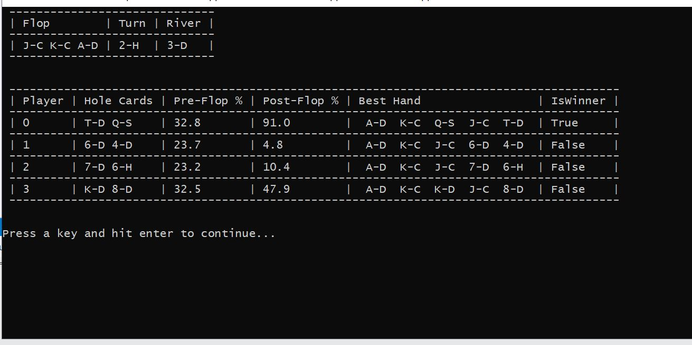

# HoldemPokerTrainer
Train yourself for live Texas Holdem games by seeing the probability of winning change as more cards are dealt.

PROJECT STATUS:
Nov 10 2019.	Simulation code works and Poker training mode works. Screenshots in the screenshots folder. Statistics look good.
		Improvements that could still be made would be a) using ConcurrentBag instead of BlockingCollection in the simulation
		code to re-use GameRecord objects which would decrease GC pressure. b) Sometimes you have to hit a key and hit Enter 			twice during each stage of Poker Training Mode. c) At end of Simulating a number of games, the main thread doesn't 			return right away because it is on a 2 minute timer. d) Number of Outs a player has at each stage could be calculated 			and shown. e) No user interface. f) Database initialization code doens't warn the user not to quit during operation and 		doesn't detect partial or corrupted databases if hte user has quit prematurely in a previous use. g) Better database 			statistics could be printed when the Show Database Statistics menu option is selected. I am moving on to other projects 		once I upload the rest of the pre-build databases.

Oct 24 2019.	Added code to create a local 'databases' directory and check to see if they are already initialized before
				rebuilding it. There is a database created for each number of players (2-8) in its own file. Each file has 1326 
				tables, one for each possible set of pocket cards. Each of those tables has 22100 rows, one for each unique 
				3-card flop. Each row records the Wins and Losses that hand has has simulated, which will make statistics easier
				to calculate. Reading from the database is much faster now.

				

Oct 18 2019.	Implementing new database code. One database table per 2-card holecard pair. Each record will have a unique prime for the 3-card flop
				and a count of wins and losses. Check the db before adding a record so that duplicate rows are note added like last time, which
				made the db unnecessarily big and disorganized.
				+can use an INTEGER column to store an 8 byte long in sqlite. Retrieve with the GetLong()?
				+notes on a workaround for ulong if necessary: 
				https://www.codeproject.com/Messages/3371916/Re-Sqlite-with-csharp-unsigned-long-problem.aspx
				+attack plan
					-switch ulong to long in my code..long will hold the primes I deal with and should work better with sqlite
					-create 1326 tables for 2-card primes in format Tbl_N where N is prime number
					-create all rows for database and zero wins and losses

Oct 15 2019.	Decide to do major rewrite to decrease line count and database reading time and decrease line count / complexity.

Oct 14 2019.	Implementing the idea below. Total number of unique hands (over 2 million) can be reduced to approximately 7462 hands (see Cactus
				Kev's poker page for an explanation).

Oct 7 2019.		Idea. Can make this faster by using Cactus Kev method of grouping certain types of hands that have same rank instead of recording
				them all in the database. This will reduce (a) number of simulated games necessary to get good statistics and thus (b) 
				total simulation time and (c) time for retrieving statistics from the sqlite database

Sept 7 2019.	Program works. Uses multi-threading and BlockingCollection to simulate games quickly and save them to a SQLite database.
				You need around 300 million games simulated (takes a few hours) to get good statistics for the post flop winning percentage.
				The SQLite queries that calculate the probabilities is slow as hell once you have 10 million or so records. I believe I could 
				fix this by using a separate Table to hold all the hands for each pair of Hole Cards and add a Table Index.

August 22 2019. Program works. It takes a few hours of simulating games to get a big enough database to see decent post-flop statistics

August 15 2019. This is my first C# program. Not currently working.

This program "simulates" thousands of Texas Holdem Hands by shuffling the deck, 
dealing the game, and saving the results to a SQLite database. 

Once the database of saved games is built up, the user can enter "Training Mode" where cards are dealt and the
probability of winning the hand is shown to them.

For example, if you have pocket Jacks and the flop is 2, 4, Queen unsuited, what are your chances
of winning a game with 4 other players? This program teaches you that.

The probabilities are calculated by running SQLite queries on the database of simulated games.

TECHNOLOGIES USED:
Visual Studio Community 2019
Github Extension
Github.com
SQLite
Test Driven Development
MSTest
ConsoleTables nuget package

